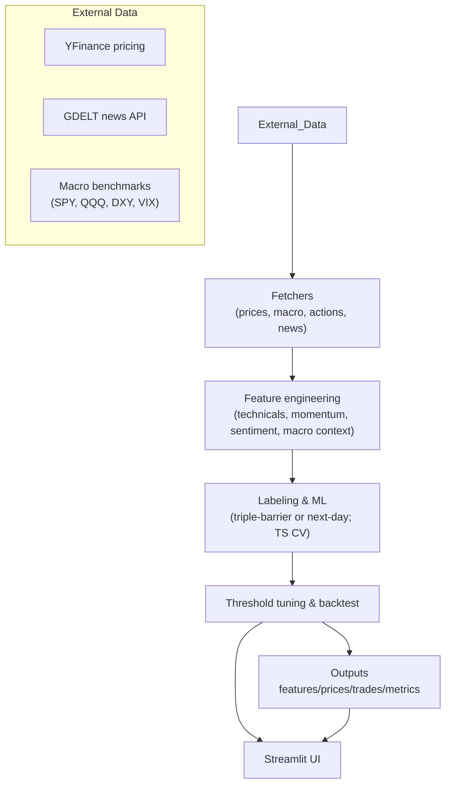

# Quantamental Signal Foundry
Quantamental Signal Foundry is a research sandbox and demo app for building machine-learning driven trading signals. It orchestrates a full quantamental workflow—fetching prices, macro benchmarks, and news headlines, engineering robust factor features, labeling trades, training models, tuning thresholds, and visualising backtest performance in a Streamlit UI.

The repo contains:
- `app.py`: production-ready Streamlit dashboard for selecting tickers, running the full pipeline, and inspecting metrics/plots/downloads.
- `alpha_pipeline.py`: the main data + modeling pipeline shared with the app (news sentiment, macro covariates, technical factors, barrier labeling, TS cross-validation).
- `quant_pipeline.py`: a lightweight variant focused on faster iteration or notebook usage.
- `notebook.ipynb`: exploratory research notebook with examples and sweep outputs.

## Quickstart
```bash
python3 -m venv .venv && source .venv/bin/activate
pip install -r requirements.txt
streamlit run app.py
```
Adjust parameters on the left sidebar, click **Run Backtest**.

## Architecture


## Generate Data Artifacts
You can pre-compute the feature matrix, labels, and trades outside the UI. The snippet below writes results to `outputs/` (which is ignored by git).

```bash
python - <<'PY'
from alpha_pipeline import build_feature_matrix, train_and_backtest

ticker = "AAPL"
start = "2020-01-01"
end = "2024-12-31"

features, prices = build_feature_matrix(
    ticker=ticker,
    start=start,
    end=end,
    news_hours=12,
    out_dir="outputs"
)

metrics, trades = train_and_backtest(
    feats=features,
    px=prices,
    label_kind="barrier",
    tune_threshold=True,
    out_dir="outputs"
)

print(metrics)
PY
```
Artifacts saved:
- `outputs/features.csv` and `outputs/prices.csv`
- `outputs/trades.csv` and `outputs/labels.csv`
- `outputs/metrics.json`

These are the same files the Streamlit app loads after you click **Run Backtest**.

## Operational Notes
- No API keys or credentials are required; the project relies on public endpoints.
- Generated data, cached responses, and notebooks are excluded from version control via `.gitignore`.
- For new research ideas, inspect `quant_pipeline.py` (slimmer runtime) or `alpha_pipeline.py` (research-focused, used by the app).
